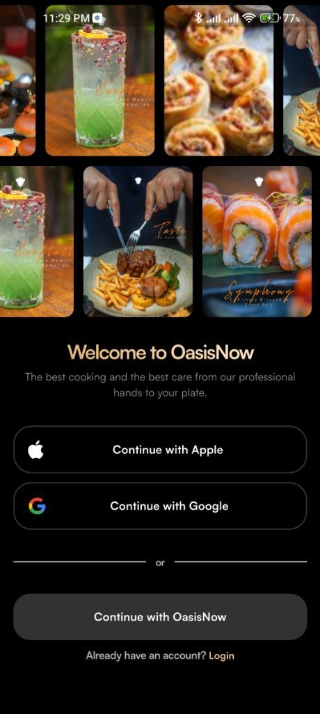

# 🚀 Recast Designs Test

Welcome to the **`recast_designs_test`** Task! 🎉 

This application uses a modern, scalable Flutter architecture designed for multi-platform support, beautiful micro-animations, and clean separation of concerns.

---

## 📦 Download APK

⬇️ **Latest Release**

[Download App (v1)](https://github.com/GeorgeNabilBolas/recast_designs_test/releases/download/v1/app-arm64-v8a-release.apk)

---

## 📸 App Screenshots

<br>
<p align="center">

  
  
  
  
  
  
</p>
<br>

---

## 🏗️ Architecture: Feature-First
I strictly use **Feature-First Clean Architecture**. 

Files are grouped by feature (e.g., `auth`), separating the UI from the business logic.

```text
lib/
├── core/                         # Global resources (theme, constants, utils)
├── features/                     # Vertically sliced feature modules
│   └── auth/                     # Authentication Module
│       ├── data/                 # API calls, local DB, models
│       └── presentation/         # UI definitions and states
│           ├── cubits/           # State Logic Handlers (AuthFormCubit)
│           ├── screens/          # Full-page scaffolds
│           ├── sections/         # Large layout building blocks
│           └── widgets/          # Reusable, standalone components
└── main.dart                     # Entry point
```

---

## 🧠 State Management: Cubit
I use `flutter_bloc` (**Cubit**) to eliminate unnecessary `setState` calls, keeping the UI lightning-fast. 

The **Auth Feature** relies on three core states:
- `SocialAuthForm`: Displays OAuth login buttons.
- `SignUpForm`: Displays Email/Password entry fields.
- `AuthFormError`: Displays validation issues.

UI components simply listen to `AuthFormCubit` and redraw precisely when the state updates.

---

## 🖼️ UI Breakdown
To enforce reusability, a screen is broken down into three layers:
1. 📱 **Screens**: Set up the `Scaffold` and scrolling bounds (using Slivers).
2. 🧱 **Sections**: Major layout parts handling specific visual goals (e.g., `animated_food_section.dart`).
3. ⚙️ **Widgets**: Small, reusable "dumb" components (e.g., `primary_button.dart`).

---

## 🔄 Form Validation Flow
When a user attempts to Sign Up:
1. Inputs are tracked in `AuthTextField`s via a global `FormState` key.
2. Clicking "Sign Up" fires the `.validate()` method.
3. Errors are sent to the state (`cubit.validate(error)`).
4. An `AuthFormError` state triggers an `AnimatedCrossFade` to smoothly reveal the error text at the bottom.

---

## 🎨 Advanced UI Features
- **Kinetic Physics**: Independent, dynamically sliding image rows.
- **Glassmorphism**: Premium gradient and styling aesthetics.
- **Responsive Sizing**: Using `context.h(16.0)` instead of fixed values (`height: 16.0`) for perfect scaling across devices.
- **Keyboard Safety**: Slivers prevent rendering overflows when the keyboard appears.

---

## 🛠️ Best Practices
✅ **Single Responsibility**: Every widget/file does exactly one thing. <br>
✅ **Null Safety First**: Strict typing and safe handling. <br>
✅ **Zero Magic Numbers**: Hardcoded sizing or colors must go into `core/`. <br>
✅ **Linter Obedience**: Fix warnings, don't ignore them. <br>
